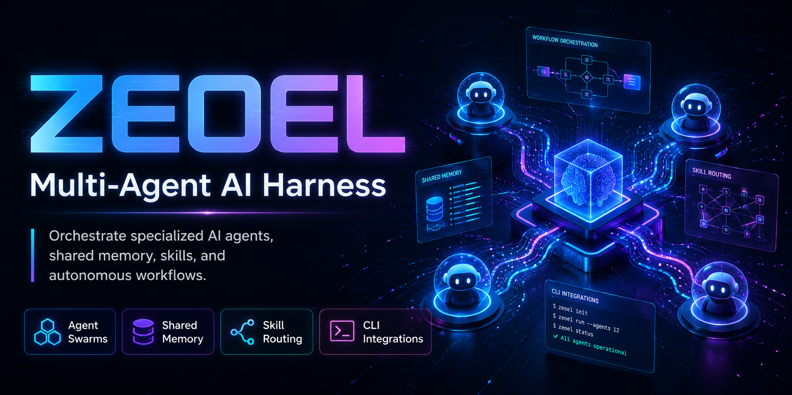

<div align="center">



# 🌌 Zeoel-AI — Autonomous Multi-Agent Software Agency

### A 33-agent orchestrator for Claude Code, Cursor, and Gemini CLI featuring smart model routing, strict Test-Driven Development (TDD), and token-saving protocols.

<p align="center">
  <a href="https://www.npmjs.com/package/zeoel-ai"></a>
  <a href="https://opensource.org/licenses/MIT"></a>
  <a href="AGENTS.md"></a>
  <a href="skills/"></a>
  <a href="https://github.com/goharabbas321/zeoel"></a>
</p>

**Zeoel-AI** is a production-grade, multi-agent SaaS software engineering agency. Instead of single, fragile LLM prompts that lose context, Zeoel-AI coordinates a complete team of 33 specialized agents (UX designers, database architects, systems engineers, security auditors, QA engineers, etc.) to brainstorm, plan, build, and verify entire software projects automatically.

[Quick Start](#-quick-start) • [The 4-Phase Pipeline](#-the-4-phase-pipeline) • [Smart Model Routing](#%EF%B8%8F-smart-model-routing) • [Optimization Protocols](#-optimization-protocols) • [33-Agent Roster](#-the-33-agent-roster) • [CLI Reference](#-cli-commands) • [User Manual](USER_MANUAL.md)

</div>

---

### Why Zeoel-AI?

> "Traditional AI coding assistants struggle with complexity because a single model prompt is asked to be the architect, developer, tester, and security auditor simultaneously. Zeoel-AI decouples these roles. It translates a product brief into a granular sprint roadmap and dispatches specialized sub-agents with dedicated skill bindings. Every piece of code is written via strict TDD, reviewed by security agents, and validated by QA—saving thousands in tokens and preventing bugs before they reach production."

---

## ⚡ Quick Start

### 1. Install Globally
Install the package globally via npm:
```bash
npm install -g zeoel-ai
```

### 2. Initialize a Workspace
Navigate to any new or existing codebase directory, and run the configuration wizard:
```bash
cd your-project
zeoel
```
The wizard will:
* 🔍 Scan for locally installed CLI engines (`claude`, `opencode`, `codex`, `agy`, `qwen`, `mimo`).
* ⚙️ Configure your primary engine and map available models.
* 📂 Initialize standard workspace directories (`frontend/`, `backend/`, `docs/`, `.worktrees/`).
* 💾 Create `zeoel.config.json` configuration and setup local script shims under `.zeoel/`.

### 3. Start Brainstorming
Open `.zeoel/start.md` in your text editor, write your product prompt inside the markdown comment block, and run:
```bash
# macOS / Linux
.zeoel/commands/start.sh

# Windows
.zeoel\commands\start.cmd
```

---

## 🔄 The 4-Phase Pipeline

Zeoel-AI enforces a strict software delivery pipeline with file-based checkpoints at every phase boundary.

```
                  THE ZEOEL-AI ORCHESTRATION PIPELINE
                  
  [ Phase 1: Brainstorm ] ──> [ Phase 2: Sprint Plan ] ──> [ Phase 3: Execute (TDD) ] ──> [ Phase 4: Verify & Ship ]
         │                             │                              │                             │
         v                             v                              v                             v
  • Gohar (CEO) Leads           • granular task breakdowns      • Strict red-green-refactor   • QA & Security audits
  • Capability verification     • auto-generated scripts        • isolative file-edits        • snapshot release branches
  • output: PROJECT_BRIEF.md    • output: docs/sprint-N/        • Graphify context isolation  • output: done.md
```

### 1. Brainstorming (`zeoel-brainstorm`)
* **Gohar (CEO)** leads a structured debate between the relevant agent specialists inside the terminal.
* Gohar performs a **Capability & Resource Check**, warning you of any missing skills or API resources, and proposes alternative architectures.
* Clarifying questions are written to `.zeoel/questions/questions.md`. The user answers in `.zeoel/answers/answers.md` to finalize constraints.
* **Deliverables**: `PROJECT_BRIEF.md` (detailed specification) and `docs/brainstorm/summary.md`.

### 2. Sprint Planning (`zeoel-sprint-planner`)
* Gohar plans the entire development roadmap, decomposing features into **10-20 highly granular, bite-sized tasks** per sprint (migrations, routing, components, etc.).
* Creates executable shell scripts for each task under `docs/sprint-N/tasks/task_K.sh`.
* Generates a semantic representation of the codebase using:
  ```bash
  /graphify . --wiki
  ```
* **Deliverables**: `docs/sprint-N/plan.md`, `docs/sprint-N/progress.md`, and `docs/sprint-N/deferred.md`.

### 3. TDD Execution (`zeoel-dispatch`)
* Tasks are executed sequentially on isolated sprint branches (`feature/sprint-N`).
* Sub-agents run in a strict **Test-Driven Development (TDD)** loop: write failing test (Red), implement minimum code to pass (Green), and optimize (Refactor).
* All source code changes are restricted to the `frontend/` or `backend/` directories.
* Sub-agents log findings in `PROJECT_BRIEF.md` and incrementally update codebase context with `/graphify . --update`.

### 4. Verification & Shipping
* **QA Signoff**: **Muhammad** validates test suites and runs E2E coverage.
* **Security Signoff**: **Hamid** runs EVM checks and OWASP security scans.
* **SEO Signoff**: **Zara** audits public page meta-tags and JSON-LD schemas.
* Gohar merges the branch, generates `docs/sprint-N/done.md`, and creates a runnable worktree archive in `.worktrees/sprint-N`.

---

## ⚙️ Smart Model Routing

Zeoel-AI maps agent capabilities to specific LLM models via `zeoel.config.json`. Mappings can be fully customized by the user:

```json
{
  "primary_engine": "claude",
  "available_engines": {
    "claude": {
      "path": "/usr/local/bin/claude",
      "models": ["claude-3-5-sonnet", "claude-3-opus", "claude-3-5-haiku"]
    },
    "opencode": {
      "path": "/usr/local/bin/opencode",
      "models": ["deepseek-v4-pro", "qwen3.7-max", "deepseek-v4-flash"]
    }
  },
  "model_mapping": {
    "primary_design_brain": { "engine": "agy", "model": "claude-3-opus" },
    "design_polish_ux_review": { "engine": "agy", "model": "claude-3-5-sonnet" },
    "frontend_builder": { "engine": "mimo", "model": "mimo-v2.5-pro" },
    "primary_security_reviewer": { "engine": "codex", "model": "gpt-5.5" },
    "primary_backend_builder": { "engine": "opencode", "model": "deepseek-v4-pro" },
    "fast_bug_fixing": { "engine": "opencode", "model": "deepseek-v4-flash" }
  }
}
```

If a mapping is omitted, Zeoel-AI falls back to **Complexity-Tier Auto-Routing**:
* 🟢 **Light Tasks**: Routed to fast, low-cost flash models (e.g., `deepseek-v4-flash`, `claude-3-5-haiku`).
* 🟡 **Standard Tasks**: Routed to professional builder models (e.g., `claude-3-5-sonnet`, `qwen3.7-max`).
* 🔴 **Complex Tasks**: Routed to advanced reasoning and flagship models (e.g., `claude-3-opus`, `gpt-5.5`).

---

## 🚀 Optimization Protocols

### 🧠 Graphify (Context Isolation)
Before dispatching a task, Zeoel-AI queries the semantic knowledge graph:
```bash
/graphify query "auth middleware and database connection"
```
This isolates exact code boundaries and dependencies, delivering up to **71.5x input token savings** by preventing agents from reading unrelated files.

### 💀 Caveman (Telegraphic Output)
Instructs sub-agents to communicate in a highly compressed, telegraphic syntax:
* Byte-preserved file diff blocks only.
* Zero conversational filler, greetings, or explanations.
* Saves up to **75% output token usage** and speeds up execution times.

---

## 👥 The 33-Agent Roster

Zeoel-AI organizes agents into specialized departments. You can view the full capabilities in [AGENTS.md](AGENTS.md).

<details>
<summary>💼 <strong>1. Management & Operations</strong></summary>

| Agent | Role | Specialty | Primary Skills (⭐) |
|---|---|---|---|
| **Gohar** | CEO & Orchestrator | Roadmap, Sprints, Codebase Checkpoints | `zeoel`, `caveman`, `graphify` |
| **Zainab** | Product Manager | Agile backlog, User Stories, Retros | `project-flow-ops`, `product-lens` |
| **Maryam** | SaaS Ops Specialist | Metric-driven analytics, Business models | `saas-ops` |

</details>

<details>
<summary>🎨 <strong>2. Design & User Experience</strong></summary>

| Agent | Role | Specialty | Primary Skills (⭐) |
|---|---|---|---|
| **Mahdi** | Product Designer | UX wireframes, User flows, accessibility audits | `frontend-design`, `seo` |
| **Mustafa** | Visual Director | WebGL, GSAP, interactive animations | `frontend-design`, `ui-ux-pro-max`, `threejs-webgl` |
| **Hasan** | CSS Craftsman | Container queries, Transitions, Flex/Grid layouts | `css-container-queries`, `tailwindcss-v4` |

</details>

<details>
<summary>⚛️ <strong>3. Frontend Engineering</strong></summary>

| Agent | Role | Specialty | Primary Skills (⭐) |
|---|---|---|---|
| **Karar** | Sr. Frontend Engineer | Next.js, Radix primitives, Tailwind | `nextjs-turbopack`, `test-driven-development` |
| **Anas** | React Developer | Vite SPAs, Zustand client state | `vite-patterns`, `frontend-design`, `caveman`, `graphify` |
| **Noor** | shadcn/UI Craftsman | Radix UI primitives, design token bindings | `shadcn-ui-patterns`, `radix-ui-primitives` |
| **Amina** | Vue/Nuxt Architect | Vue 3 composition, Nuxt 4 SSR | `vue3-composition-patterns`, `nuxt4-patterns` |
| **Hassan** | Bootstrap Builder | SCSS styling, Bootstrap 5 dashboards | `bootstrap-patterns`, `frontend-design` |

</details>

<details>
<summary>🔧 <strong>4. Backend & Systems</strong></summary>

| Agent | Role | Specialty | Primary Skills (⭐) |
|---|---|---|---|
| **Tariq** | Backend Engineer | Laravel, PostgreSQL, APIs, Stripe integration | `laravel-patterns`, `test-driven-development` |
| **Abbas** | Python Developer | Django, FastAPI, async task queues | `python-patterns`, `test-driven-development` |
| **Bilal** | Systems Engineer | Go, Rust, C++ high-performance services | `go-patterns` |
| **Yusuf** | Enterprise Java | Spring Boot, Quarkus, microservices | `java-patterns` |
| **Fatima** | Data Architect | Postgres schemas, OLAP, ClickHouse, ML | `postgres-patterns`, `python-patterns` |

</details>

<details>
<summary>📱 <strong>5. Mobile Engineering</strong></summary>

| Agent | Role | Specialty | Primary Skills (⭐) |
|---|---|---|---|
| **Abdullah** | Flutter Developer | Multi-platform Flutter, Riverpod, Dart | `dart-flutter-patterns` |
| **Zayd** | React Native Developer | Expo, Native modules, JavaScript | `react-native-best-practices` |
| **Layla** | iOS Developer | SwiftUI, Swift Concurrency, native iOS | `swift-patterns` |
| **Hamza** | Android Developer | Kotlin, Jetpack Compose, native Android | `kotlin-patterns` |

</details>

<details>
<summary>🛡️ <strong>6. Security, QA & DevOps</strong></summary>

| Agent | Role | Specialty | Primary Skills (⭐) |
|---|---|---|---|
| **Hamid** | Security Auditor | OWASP audits, EVM auditing, Pen testing | `claude-red`, `trailofbits-auditing` |
| **Muhammad** | QA Lead | Unit, Integration, E2E playbooks | `e2e-testing`, `test-driven-development` |
| **Ali** | DevOps Engineer | CI/CD pipelines, Docker, Cloud orchestration | `deployment-patterns` |
| **Ibrahim** | AI Architect | Multi-agent frameworks, custom MCP servers | `mcp-patterns`, `self-evolution` |

</details>

<details>
<summary>📊 <strong>7. Domain & Marketing Specialists</strong></summary>

| Agent | Role | Specialty | Primary Skills (⭐) |
|---|---|---|---|
| **Khadija** | Healthcare Expert | HIPAA, FHIR integrations, compliance | `healthcare-compliance` |
| **Salman** | Web3 & Smart Contracts | Solidity, EVM protocols, DeFi mechanics | `solidity-patterns`, `trailofbits-auditing` |
| **Zara** | Technical SEO Expert | JSON-LD, PageSpeed, metadata audits | `seo`, `seo-growth` |
| **Farhan** | Growth Marketer | CRO, Landing page copy, funnel mapping | `growth-marketing`, `seo-growth` |
| **Taha** | Slides & PPT Designer | McKinsey HTML decks, Chart.js templates | `ppt-mckinsey`, `ckm:slides` |
| **Sami** | GIS & Spatial Designer | PostGIS, GeoJSON, parametric architecture | `computational-architecture`, `postgres-patterns` |
| **Yahya** | Research Scientist | Scientific literature, empirical analysis | `empirical-research`, `deep-research` |
| **Sajjad** | Systematic Debugger | Log trace, stack trace, bug resolution | `systematic-debugging`, `error-handling` |
| **Baqir** | Technical Writer | OpenAPI specs, developer docs, wiki mapping | `zeoel-codebase-knowledge`, `api-design` |

</details>

---

## 🖥️ CLI Commands

```bash
# Launch workspace initialization / configuration wizard
zeoel

# List all discovered agents in current registry
zeoel agent list

# Inspect a specific agent's prompt, skills, and configuration
zeoel agent inspect karar-frontend

# Execute a dry-run task for a specific agent
zeoel agent run karar-frontend "Design responsive navbar"

# Execute a live task with real LLM calls
zeoel agent run karar-frontend "Design responsive navbar" --live

# Execute a live task using deepseek model on opencode engine
zeoel agent run karar-frontend "Design responsive navbar" --live --engine opencode -m deepseek-v4-pro
```

---

## 📬 Contact & Support

* **GitHub**: [goharabbas321/zeoel](https://github.com/goharabbas321/zeoel)
* **NPM**: [zeoel-ai](https://www.npmjs.com/package/zeoel-ai)
* **Creator**: Gohar Abbas ([@goharabbas321](https://github.com/goharabbas321))
* **Telegram**: [@goharabbas786](https://t.me/goharabbas786)

---

## 📄 License

MIT © [Gohar Abbas](https://github.com/goharabbas321)
